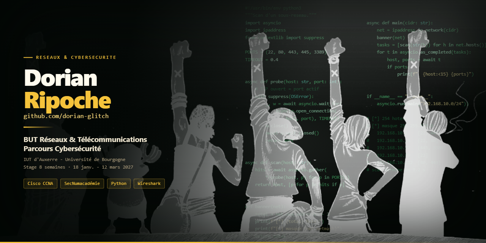

## Bonjour 👋

Étudiant en **2ᵉ année de BUT Réseaux et Télécommunications**, parcours **Cybersécurité**,
à l'IUT d'Auxerre - Université de Bourgogne.

Ce qui m'intéresse : construire une infrastructure réseau, puis chercher par où elle casse.

> **Je recherche un stage de 8 semaines, du 18 janvier au 12 mars 2027**, en
> administration réseaux et systèmes ou en cybersécurité.
> 📍 Auxerre / Palaiseau · ✉️ dorian@ripoche.org

---

### Projets

**[Réseau d'un établissement de santé](https://github.com/dorian-glitch/SAE101deprez)**
Conception complète de l'infrastructure d'un hôpital : 8 VLAN cloisonnés par service,
ToIP, WiFi, plan d'adressage, chiffrage du matériel et estimation de la consommation.
Maquette validée sous Cisco Packet Tracer.

**[Gestion des inscriptions à la remise des diplômes](https://github.com/dorian-glitch/SAE204-Projet-Integratif-Remise-Diplomes-BUT-Auxerre)**
Application web pour la cérémonie du campus d'Auxerre - HTML, CSS, PHP, MySQL.

**[Évolution de la production d'électricité](https://github.com/dorian-glitch/SA-1.05--Projet-n-6)**
Traitement d'un jeu de données et visualisations en Python : cartes, courbes, histogrammes.

**[Télémétrie d'un ballon-sonde](https://github.com/dorian-glitch/TP2-ballon-sonde_dorian_oumar_V2)**
Parsing d'un relevé de vol et tracé des températures en fonction de l'altitude.

---

### Compétences

| | |
|---|---|
| **Réseaux** | Routeurs et switchs Cisco, VLAN, routage inter-VLAN, ToIP, Wireshark |
| **Cybersécurité** | Segmentation, filtrage, sensibilisation aux cybermenaces |
| **Programmation** | Python, HTML, CSS, SQL |
| **Outils** | Cisco Packet Tracer, WordPress, Claude Code |

### Certifications

- **CCNA : Switching, Routing & Wireless Essentials** - Cisco
- **CCNA : Introduction to Networks** - Cisco
- **Digital Safety and Security Awareness** - Cisco
- **MOOC SecNumacadémie** - ANSSI
- **PIX** - niveaux 1 à 4

[Mes certifications sur Credly](https://www.credly.com/users/dorian-ripoche) ·
[LinkedIn](https://www.linkedin.com/in/dorian-ripoche-500819357/)

---

### Langues

Français (langue maternelle) · Anglais B2 · Allemand B2
